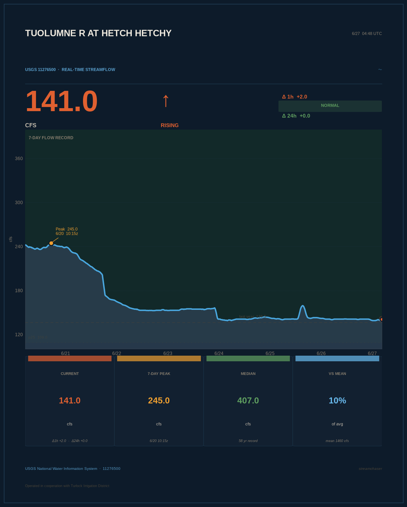
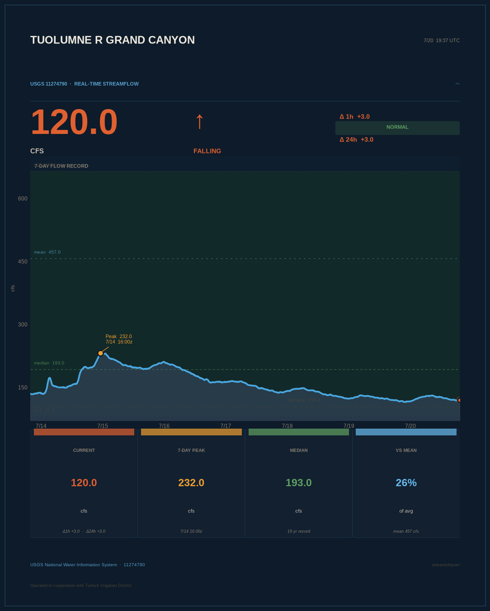
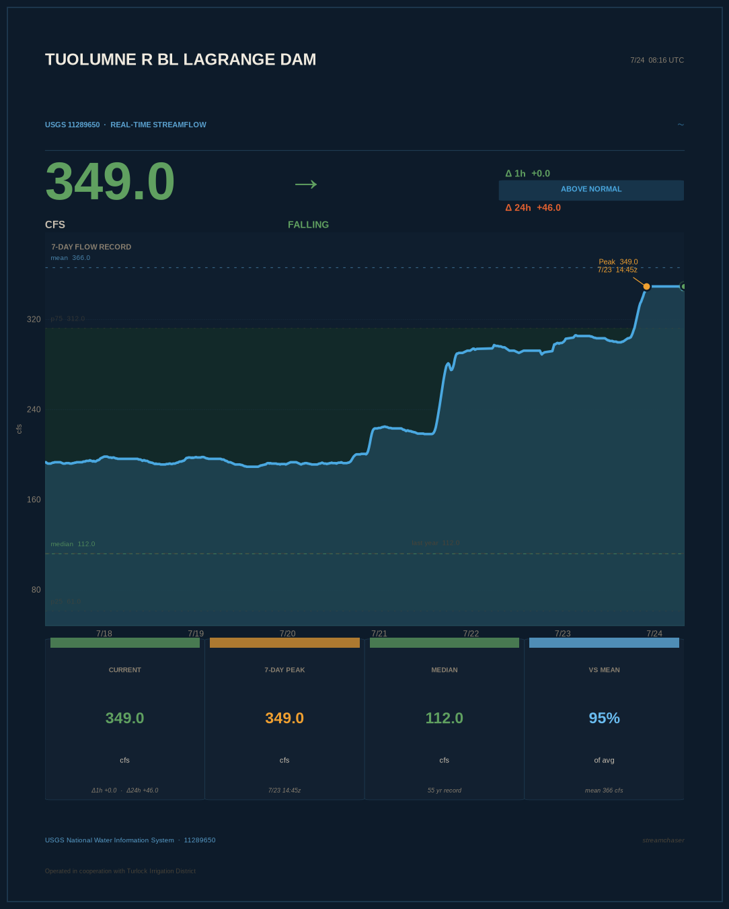
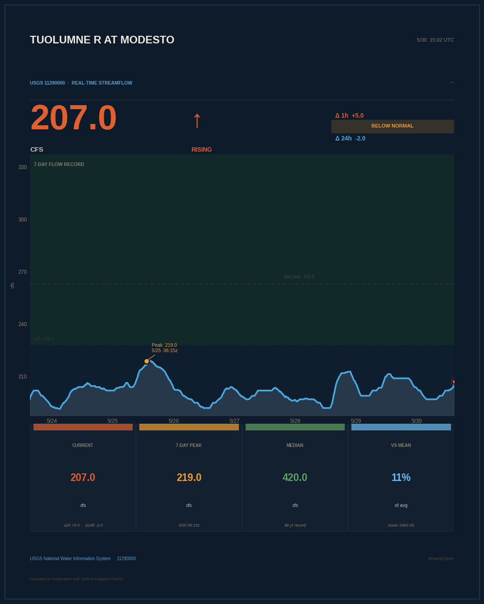
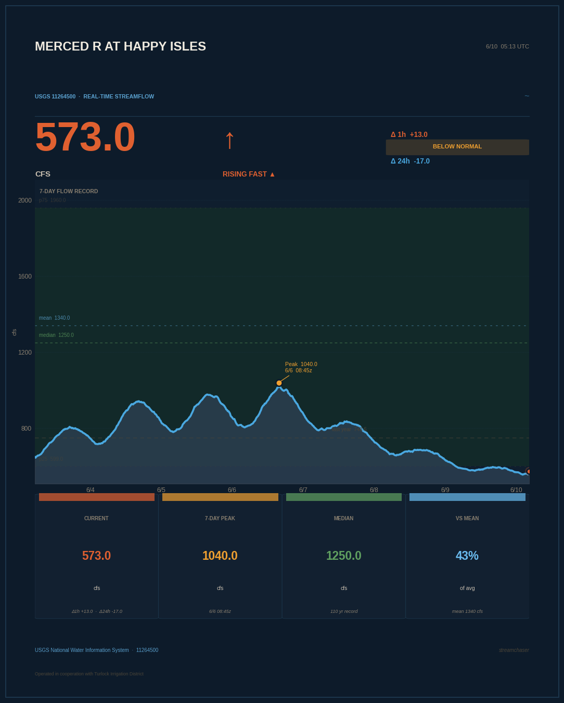
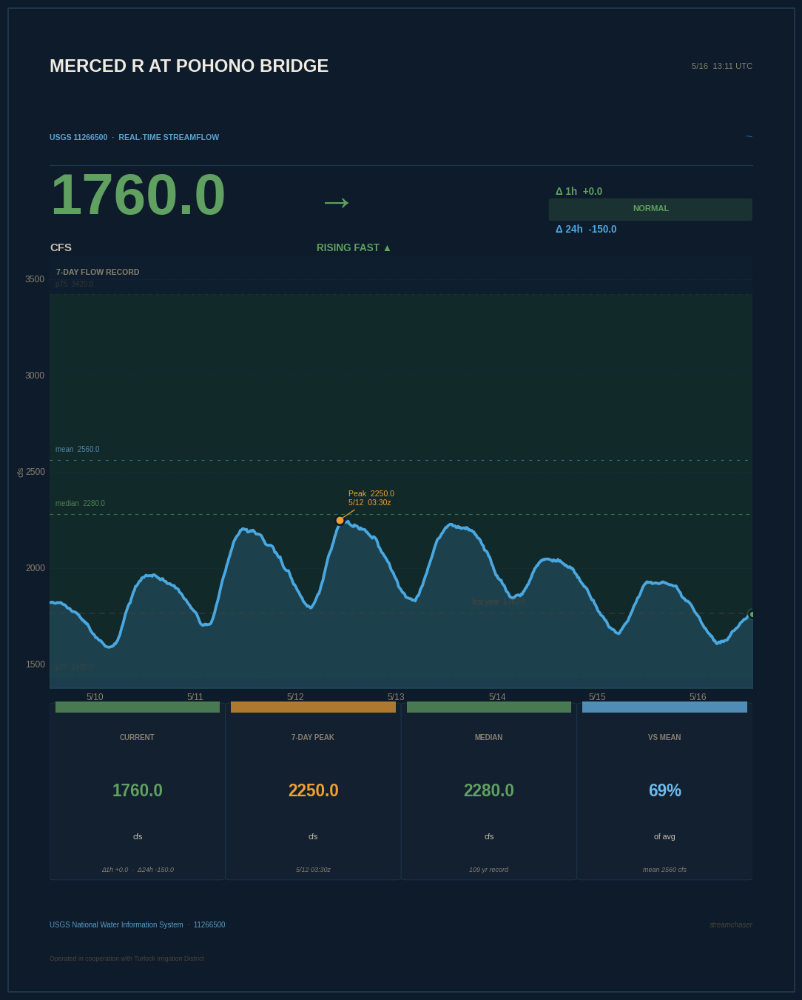
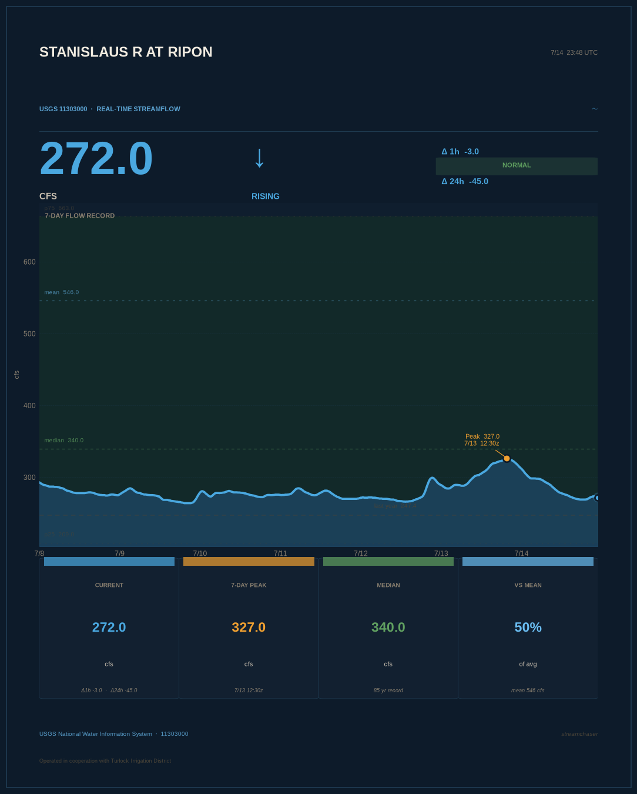

# streamchaser

> *You don't chase the water. You read it.*

Groveland, California sits at 2,800 feet on the western slope of the Sierra Nevada, halfway between the Central Valley floor and Yosemite Valley. The Tuolumne River runs through the canyon a thousand feet below town. Big Creek drains the hills right behind the fire station. Cherry Creek drops out of the high country from the north, cold and fast, before it meets the mainstem below.

All of it flows down to Don Pedro Reservoir, through the valley, and into the San Joaquin. All of it tells a story if you know how to read it.

This bot watches eleven gauges across three Sierra Nevada watersheds — simultaneously, around the clock — and says nothing unless something is worth saying.

---

## Latest readings

### 〰 Tuolumne Watershed

#### Tuolumne R at Hetch Hetchy
*Headwaters. First to spike. Downstream from O'Shaughnessy Dam.*


*[Live USGS page →](https://waterdata.usgs.gov/monitoring-location/11276500/)*

#### Tuolumne R Grand Canyon
*Wild canyon reach. Below Hetch Hetchy, above any valley influence.*


*[Live USGS page →](https://waterdata.usgs.gov/monitoring-location/11274790/)*

#### Tuolumne R BL Early Intake
*Pre–Don Pedro. Above Cherry Creek confluence.*


*[Live USGS page →](https://waterdata.usgs.gov/monitoring-location/11276900/)*

#### Tuolumne R BL LaGrange Dam
*Below all major dams. What actually enters the valley.*


*[Live USGS page →](https://waterdata.usgs.gov/monitoring-location/11289650/)*

#### Tuolumne R at Modesto
*Valley floor. The bottom line for Central Valley water.*


*[Live USGS page →](https://waterdata.usgs.gov/monitoring-location/11290000/)*

---

### 〰 Merced Watershed

#### Merced R at Happy Isles
*Raw Yosemite backcountry signal. Above Pohono Bridge.*


*[Live USGS page →](https://waterdata.usgs.gov/monitoring-location/11264500/)*

#### Merced R at Pohono Bridge
*Classic Yosemite Valley gauge. Spectacular in flood years.*


*[Live USGS page →](https://waterdata.usgs.gov/monitoring-location/11266500/)*

---

### 〰 Stanislaus Watershed

#### Stanislaus R at Ripon
*Valley floor. Below New Melones Reservoir.*


*[Live USGS page →](https://waterdata.usgs.gov/monitoring-location/11303000/)*

---

### 〰 Local Tributaries

#### Big Creek @ Whites Gulch
*The hometown gauge. No dams. Pure signal. The canary in the watershed.*


*[Live USGS page →](https://waterdata.usgs.gov/monitoring-location/11284400/)*

#### Cherry Creek NR Early Intake
*The high-country canary. Spikes first. Drops fast. Drains the granite.*


*[Live USGS page →](https://waterdata.usgs.gov/monitoring-location/11278300/)*

*Charts updated every hour by GitHub Actions. Posted to social when something notable happens.*

---

## How a storm moves through the Sierra

When an atmospheric river comes off the Pacific and hits the Sierra, it doesn't flood all at once. It moves in sequence — and if you're watching the right gauges, you can see it coming.

**Happy Isles and Hetch Hetchy** respond first. They drain bare granite above 4,000 feet — thin soil, nowhere for the rain to go but down. When a storm hits, these show it within hours.

**Grand Canyon of the Tuolumne and Early Intake** catch the pulse next as it consolidates in the canyon. This is where you start to see the full shape of the hydrograph forming.

**Cherry Creek** — the high-country canary — spikes fast and drops fast. It's the warning shot for the local watershed, draining terrain that doesn't forgive.

**LaGrange and Modesto** tell you what the valley is actually going to receive — after the reservoirs have taken their cut, after the diversions have started, after the pulse has smoothed out over days of travel.

**Pohono Bridge** shows the Merced doing its own thing — Yosemite Valley floods independently of the Tuolumne, and the two watersheds don't always move together.

**Ripon** is the Stanislaus at the valley floor — a different watershed, different reservoir system, different behavior, but part of the same Central Valley water story.

**Big Creek** is the honest gauge. No dams. No regulation. Whatever the Sierra is doing, Big Creek shows it directly.

Watch a big storm event: a spike at Hetch Hetchy on Monday becomes a spike at Modesto by Thursday.

Between all eleven gauges: over 400 years of combined USGS record.

---

## Alert thresholds

Two threshold systems depending on the gauge type:

**Large/regulated rivers** (Tuolumne mainstem, Merced, Stanislaus) — absolute cfs thresholds:

| Status | Flow | What it means |
|---|---|---|
| 🟡 Elevated | ≥ 200 cfs | Active snowmelt or moderate storm response |
| 🟠 High | ≥ 1,000 cfs | Significant flood potential — monitor closely |
| 🔴 Flood | ≥ 5,000 cfs | Major flood event |

**Small/unregulated streams** (Big Creek, Cherry Creek) — proportional thresholds:

| Trigger | What it means |
|---|---|
| Rising fast | ≥ 10% of historical mean per hour |
| Above normal | Current flow > p75 historical percentile |
| Going dry | Flow < 1.0 cfs |
| Flow returning | Was dry yesterday, now rising |

All gauges also alert on: **new 7-day peak** (set within 2 hours).

Bot stays silent outside these triggers. One post per notable event per gauge.

---

## How it's built

```
streamchaser/
├── .github/workflows/
│   └── chase.yml                   # runs every hour via cron
├── chart/
│   ├── big_creek.png
│   ├── cherry_creek.png
│   ├── hetch_hetchy.png
│   ├── tuolumne_grand_canyon.png
│   ├── tuolumne_early_intake.png
│   ├── tuolumne_lagrange.png
│   ├── tuolumne_modesto.png
│   ├── merced_happy_isles.png
│   ├── merced_pohono.png
│   ├── stanislaus_ripon.png
│   └── latest.png                  # = big_creek.png
├── src/streamchaser/
│   ├── __main__.py                 # orchestration, 11 stations, dual thresholds
│   ├── gauge.py                    # USGS API calls + stat computation
│   ├── chart.py                    # portrait chart generation
│   └── poster.py                   # Twitter/X + Bluesky
└── README.md
```

Runs on GitHub Actions free tier — about 600 minutes/month out of the 2,000 allotted (11 gauges × ~3 min each × 24 runs/day). No server. No database. Just a cron job and some USGS JSON.

---

## Fork it for your own watershed

1. Fork the repo
2. Edit the `STATIONS` list in `__main__.py` — add any USGS station ID, set `mode` to `"proportional"` for small streams or `"absolute"` for large rivers
3. Find station IDs at [waterdata.usgs.gov](https://waterdata.usgs.gov)
4. Add secrets to GitHub (Settings → Secrets → Actions):

| Secret | What |
|---|---|
| `TWITTER_API_KEY` | Consumer Key — developer.x.com |
| `TWITTER_API_SECRET` | Consumer Secret |
| `TWITTER_ACCESS_TOKEN` | Access Token (Read+Write) |
| `TWITTER_ACCESS_SECRET` | Access Token Secret |
| `BLUESKY_HANDLE` | e.g. `yourname.bsky.social` |
| `BLUESKY_APP_PASSWORD` | bsky.app → Settings → App Passwords |

---

## Data source

USGS National Water Information System — public domain, no API key required.

- Instantaneous values: `waterservices.usgs.gov/nwis/iv/`
- Historical statistics: `waterservices.usgs.gov/nwis/stat/`
- Parameter `00060` = Discharge, cubic feet per second

---

## License

MIT. Watch your own creek.
