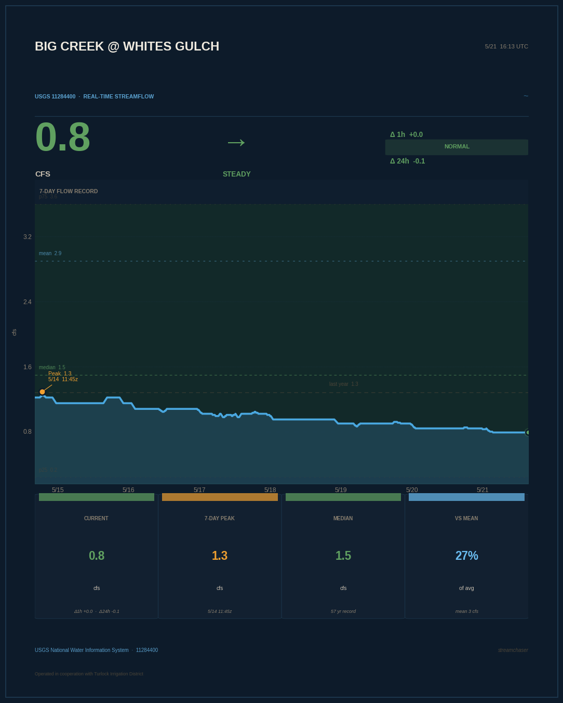
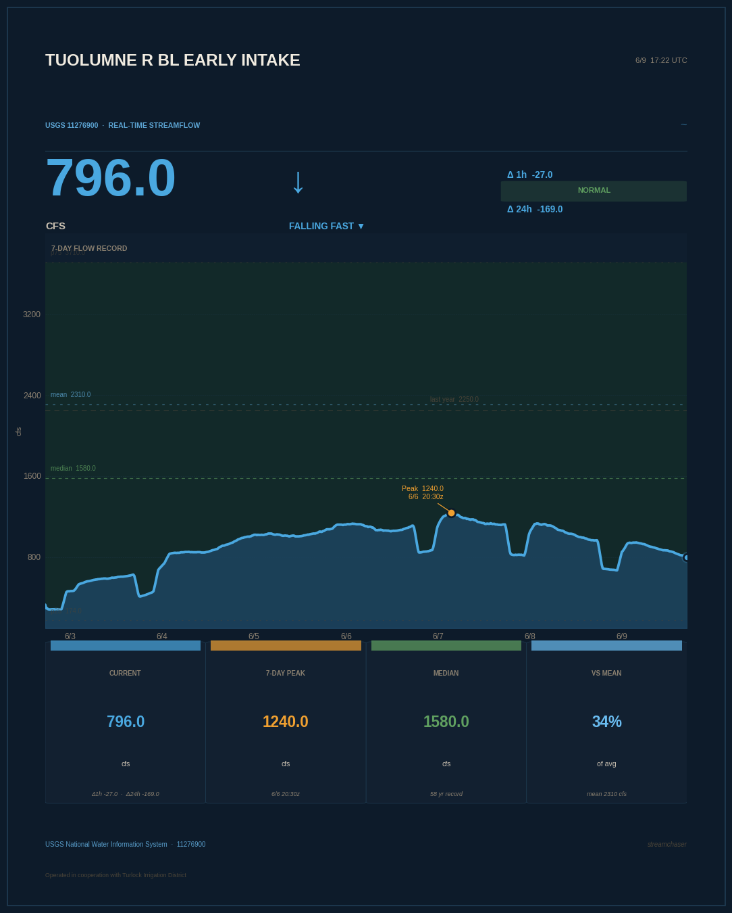
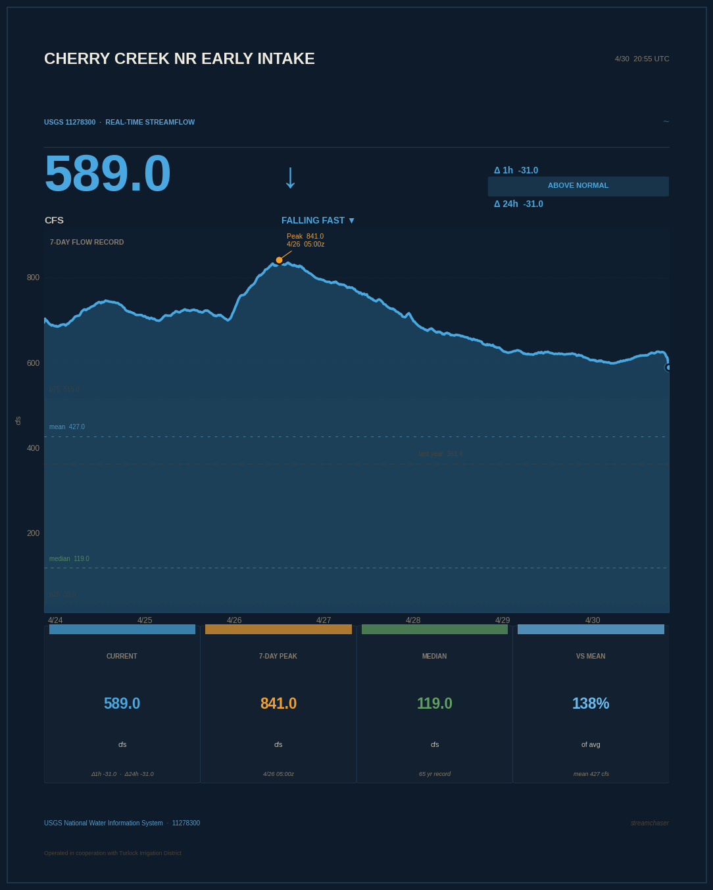

# streamchaser

> *You don't chase the water. You read it.*

Big Creek runs through the hills above Groveland, California — my hometown. It drains the western slope of the Sierra Nevada, feeds Don Pedro Reservoir, and in a wet year it moves. In a dry year it barely whispers. After a storm rolls through, it can go from 6 cfs to 300 cfs in a matter of hours.

This bot watches the whole watershed so I don't have to.

---

## Latest readings

### Big Creek @ Whites Gulch

*[Live USGS page →](https://waterdata.usgs.gov/monitoring-location/11284400/)*

### Tuolumne River BL Early Intake

*[Live USGS page →](https://waterdata.usgs.gov/monitoring-location/11276900/)*

### Cherry Creek NR Early Intake

*[Live USGS page →](https://waterdata.usgs.gov/monitoring-location/11278300/)*

*Updated every hour by GitHub Actions.*

---

## Why this watershed

**Groveland, California** sits at the edge of the Stanislaus National Forest, just west of Yosemite. Big Creek drains the hills right behind town. The Tuolumne River runs through the canyon below. Cherry Creek drops out of the high country from the north. All of it feeds Don Pedro Reservoir downstream.

When an atmospheric river hits the Sierra, you can watch the pulse move through — Cherry Creek spikes first from the high elevation snowmelt and rain, then the mainstem Tuolumne rises, then Big Creek responds as the foothills saturate. This bot watches all three simultaneously.

Big Creek has been gauged since 1969. The Tuolumne at Early Intake since 1963. Cherry Creek since 1956. Between them, over 150 years of combined record.

Operated in cooperation with [Turlock Irrigation District](https://www.tid.org/), which manages Don Pedro downstream.

---

## What the charts show

- **Current flow** in cubic feet per second, with trend direction
- **7-day record** — the full hydrograph with annotated peak
- **Percentile bands** — green is the normal range (p25–p75) based on 50+ years of same-date data
- **Percentile needle** (right edge) — where today sits in the full historical distribution
- **Rate of change** — accelerating, holding, or dropping
- **vs. long-term mean** — how today compares to every same-date reading on record

Posts go out when something notable happens — rising fast, new peak, above normal, going dry, or flow returning after dry. Silent otherwise.

---

## Repo layout

```
streamchaser/
├── .github/workflows/
│   └── chase.yml                   # runs every hour
├── chart/
│   ├── big_creek.png               # updated every hour
│   ├── tuolumne_early_intake.png
│   ├── cherry_creek.png
│   └── latest.png                  # = big_creek.png (README default)
├── src/streamchaser/
│   ├── __main__.py                 # orchestration, stations list, notability
│   ├── gauge.py                    # USGS API + stat computation
│   ├── chart.py                    # matplotlib chart generation
│   ├── chart_preview.py            # local test render
│   └── poster.py                   # Twitter/X + Bluesky
└── README.md
```

---

## Add your own gauge

1. Fork the repo
2. Add your station to the `STATIONS` list in `__main__.py`:

```python
STATIONS = [
    ("11284400", "Big Creek @ Whites Gulch", "#USGS #BigCreek #Groveland"),
    ("11276900", "Tuolumne R BL Early Intake", "#USGS #Tuolumne #Groveland"),
    ("11278300", "Cherry Creek NR Early Intake", "#USGS #CherryCreek #Tuolumne"),
    # Add yours here — find station IDs at waterdata.usgs.gov
]
```

3. Add 6 GitHub secrets (Settings → Secrets → Actions):

| Secret | What |
|---|---|
| `TWITTER_API_KEY` | Consumer Key — developer.x.com |
| `TWITTER_API_SECRET` | Consumer Secret |
| `TWITTER_ACCESS_TOKEN` | Access Token (needs Read+Write) |
| `TWITTER_ACCESS_SECRET` | Access Token Secret |
| `BLUESKY_HANDLE` | e.g. `yourname.bsky.social` |
| `BLUESKY_APP_PASSWORD` | bsky.app → Settings → App Passwords |

---

## Data source

USGS National Water Information System — public API, no key required.

- Instantaneous values: `waterservices.usgs.gov/nwis/iv/`
- Historical statistics: `waterservices.usgs.gov/nwis/stat/`
- Parameter `00060` = Discharge, cubic feet per second

---

## License

MIT. Watch your own creek.
